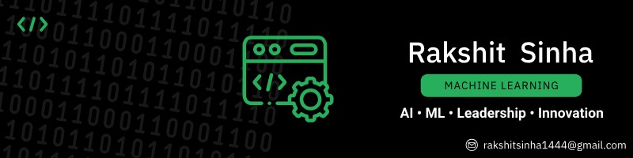

# Rakshit Sinha

**ML Engineer · Full Stack Developer · Open Source Builder**

B.Tech Computer Science @ VIT Vellore '28
Vice Chairperson, The AI & ML Club (TAM-VIT) · 🏆 Best Technical Club 2025

---

### About Me

Second-year CS undergrad at VIT Vellore. I build end-to-end AI systems — from edge inference pipelines on NVIDIA Jetson hardware to full-stack web apps backed by LLMs. Most of my work sits at the intersection of computer vision, NLP, and real-world Indian-context problems.

- 🚁 Built **Hawk-I** — a drone infrastructure inspection system with dual-model edge inference (YOLOv11n TensorRT INT8 + Grounding DINO), DINOv2 temporal anomaly detection, and Gemma-3 LLM report generation
- 🌾 Built **KisanSathi** — an offline-first crop disease detection app with a MobileNetV2 TFLite model (~94% val accuracy) and federated learning module
- 🔬 Exploring **deep learning architectures**, **edge AI deployment**, and **LLM orchestration**
- 🤝 Open to collaborating on ML/AI projects, open-source tools, and hackathon teams
- 🎯 Actively targeting **AI/ML internships** for Summer 2025

---

### Tech Stack

**Languages**

**AI / ML**

**Backend & Infra**

**Tools & Platforms**

---

### Featured Projects

<table>
  <tr>
    <td width="50%" valign="top">
      <h3>🚁 <a href="https://github.com/Arvoxis/hawk-i">Hawk-I</a></h3>
      
Drone-based infrastructure inspection system with dual-model edge inference on NVIDIA Jetson Orin Nano. YOLOv11n (TensorRT INT8, 60+ FPS) + Grounding DINO zero-shot detection, SAM 3 segmentation, DINOv2 temporal anomaly detection, and Gemma-3 12B LLM report generation grounded in IS 456 / IRC standards.

      

        
        
        
        
      

      
<strong>Equinox '26 · Smart Infrastructure Track</strong>

    </td>
    <td width="50%" valign="top">
      <h3>🌾 <a href="https://github.com/Arvoxis/KisanSathi">KisanSathi</a></h3>
      
Offline-first crop disease detection app for Indian farmers. MobileNetV2 trained on PlantVillage (~94% val accuracy), converted to TFLite with dynamic range quantization. Features FasalDoc disease scanner, Crop Risk Score, and a federated learning module for privacy-preserving model updates.

      

        
        
        
      

      
<strong>FantomCode 2026 · AgriTech Track</strong>

    </td>
  </tr>
  <tr>
    <td width="50%" valign="top">
      <h3>📈 <a href="https://github.com/Arvoxis/StockSense">StockSense</a></h3>
      
AI-powered stock dashboard with real-time prices, interactive charts, and Claude AI buy/sell/hold recommendations. Built with a Node.js backend, MongoDB for persistence, and Finnhub for live market data.

      

        
        
        
      

    </td>
    <td width="50%" valign="top">
      <h3>🔬 <a href="https://github.com/Arvoxis/Research-assistant">Research Intelligence Engine</a></h3>
      
Multi-source document pipeline with semantic search, knowledge graph construction, claim extraction, and literature gap detection. FastAPI backend with a React frontend and real-time streaming results via FAISS + spaCy.

      

        
        
        
        
      

    </td>
  </tr>
</table>

---

### GitHub Stats

---

*Building AI systems that work in the real world. Always open to interesting conversations and collaborations.*

